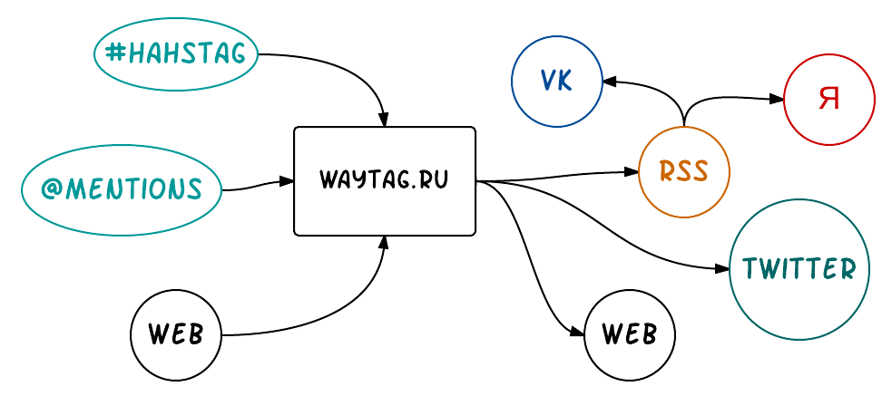
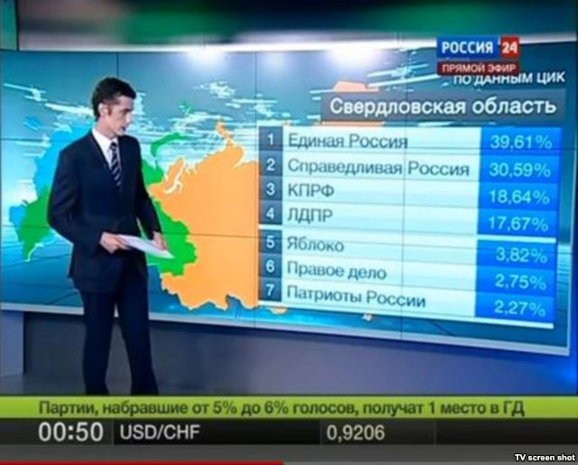
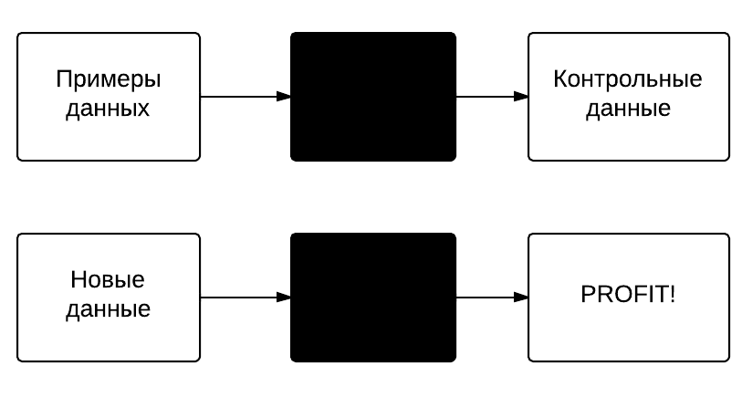
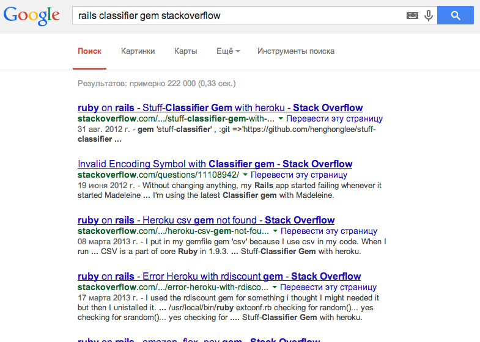
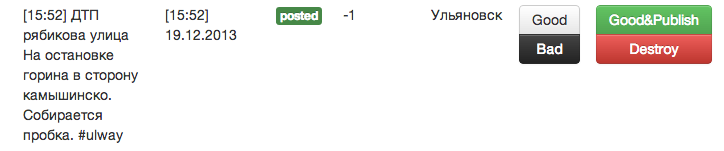
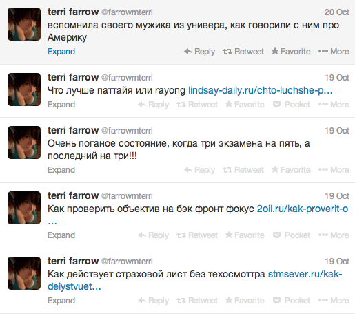
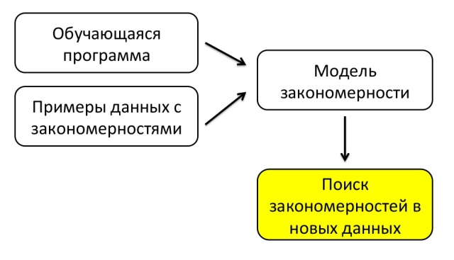

---

layout: ribbon

style: |

    #Cover h2 {
        margin:30px 0 0;
        color:#FFF;
        text-align:center;
        font-size:70px;
        }
    #Cover p {
        margin:10px 0 0;
        text-align:center;
        color:#FFF;
        font-style:italic;
        font-size:20px;
        }
        #Cover p a {
            color:#FFF;
            }
    #Picture h2 {
        color:#FFF;
        }
    #SeeMore h2 {
        font-size:100px
        }
    #SeeMore img {
        width:0.72em;
        height:0.72em;
        }
    #Dollar h2 {
      color: #000
      }
    #Scheme img {
      width: 745px
      }
---

# Машинное обучение на службе вашего города
{:.cover #Cover }

*[Андрей Кулаков](http://8xx8.ru/)*

## **Waytag.ru**

## Откуда и куда {#Scheme}

## @Ulway

* 18 000 сообщений за всю историю проекта
* 30-60 сообщений в день
* Читают: 2 122 (Twitter) + 11 310 (VK)
* ~200 посещений сайта в сутки

## Проблема Краудсо́рсинга

* …боты
* …люди

## **DO OR DIE** {#Dollar}

## Решение № 1

* Сделаем регулярочку со всеми непрятными сочетаниями букв
* …Если сообщение потходит под регулярочку, то не пропускаем

## Решение № 1
    [
      "прода(ю|м|дим)", "купл(ю|им)", "RT"
    ].each do |stop_word|
      word.match stop_word
    end

* ……

## FAIL

## Решение № 2

* Считаем частоту употребления слова в хороших сообщениях
* …`rate` = среднее арифметическаое частот слов в сообщении
* …`threshold` = (среднее арифметическое всех `rate`) * 34,546647
* …Если `rate` > `threshold` - публикуем и увеличиваем частоту всех слов которые в нем были
* ……

## FAIL

## FAIL

* Постоянный рост частот
* Игнорирование плохих кейсов
* …Математическая сиатистика? Не, не слышал.

## **Машинное обучение**

## Наверное так

## Решение № 3

## Решение № 3

https://github.com/chochkov/GreenMidget

* …gem 'green_midget'
* …bundle install
* …bundle exec rake green_midget:setup:active_record
* …cap deploy production

## Решение № 3

## FAIL

## На самом деле

## Матчасть

* X — множество объектов;
* Y — множество ответов;
* y∗: X → Y — неизвестная зависимость (target function).

## Этапы решения задач машинного обучения

* понимание задачи и данных;
* …предобработка данных и изобретение признаков;
* …выбор модели и метода обучения;
* …обучение
* …оценивание качества;
* …внедрение и эксплуатация

## Наивная классификация

* …Pr(Признак/Категория)
* …Предполагаем, что эти вероятности независимы
* …Pr(Текст/Категория)
* …Pr(A/B) = (Pr(B/A) * Pr(A)) / Pr(B)
* …Bayes = Pr(Текст/Категория) * Pr(Категория)
* …Выбираем максимальный Bayes

## WIN?

* Почему не подошел GreenMidget
* …Вычисление признаков
* …Взвешенная вероятность
* …Пороговые значения

## Метод Фишера

* Если вероятности были независимы и случайны, то результат вычисления подчинялся бы распределению хи-квадрат
* …Pr(Категория/Признак)
* …Коэф фишера

## Перекладываем задачу на нас

* объект – сообщение
* ответ – good / bad
* признак - слово в н.ф.

## fisher_classifier

* https://github.com/Andrew8xx8/fisher_classifier/
* …конфигурирование выделения признаков
* …конфигурирование констант
* …конфигурирование хранилища
* …Ruby-мета няшки

## **Готовим данные**

## Скользящий контроль

* Разбиваем множество X и Y на N независимых частей
* Тестируем каждую част отдельно, считая функцию потерь
* Считаем среднее арифметическое функции потерь

## Результаты

|  Сообщения     | Кейсы       | Результат |
+----------------|-------------|-----------|
| 100            | 8           | 0.333     |
| 400            | 8           | 0.375     |
| 10000          | 8           | 0.200     |

* …ООООЧень долго выполняются

## **DEMO**

## **WIN?**

## Спасбо за просмотр
{:.cover #Picture}

