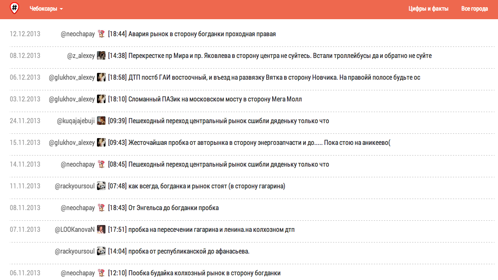
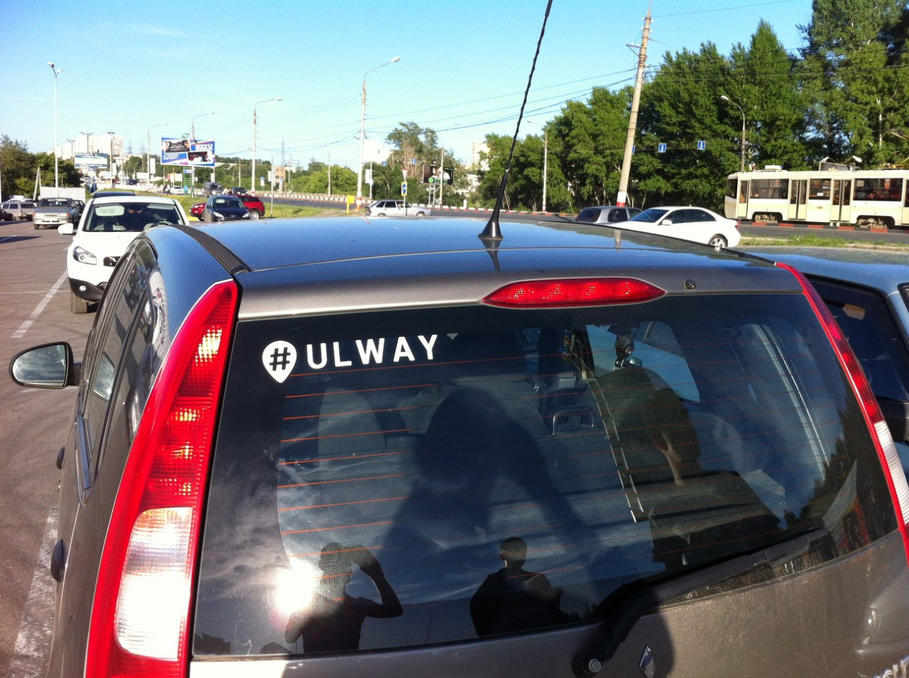

---

layout: ribbon

style: |
    @font-face {
      font-family: 'Russian Road Sign';
      src: url('/pictures/fonts/russianroadsign-medium-webfont.eot');
      src: url('/pictures/fonts/russianroadsign-medium-webfont.eot?#iefix') format('embedded-opentype'), url('/pictures/fonts/russianroadsign-medium-webfont.woff') format('woff'), url('/assets/russianroadsign-medium-webfont.ttf') format('truetype'), url('/pictures/fonts/russianroadsign-medium-webfont.svg#russian_road_signmedium') format('svg');
     font-weight: normal;
     font-style: normal;
    }
      #Fail img {
      width: 1064px
    }
      #Fail h2 {
      color: #fff
    }
    #Bonus img, #Site img, #Cover img {
      width: 1064px
    }
    #Cover h2 {
        margin:245px 0 0;
        color:#FFF;
        text-align:center;
        font-size:70px;
        text-shadow: 0 2px 10px #000
        }
    #Bonus h2 {
        color:#000;
        text-align:left;
        font-size:70px;
        }
    #Cover p {
        margin:10px 0 0;
        text-align:center;
        color:#FFF;
        font-style:italic;
        font-size:24px;
        text-shadow: 0 2px 4px #000
        }
        #Cover p a {
            color:#FFF;
            }
    #Waytag {
      background: #000;
    }
    #Waytag h2 {
      font-family: 'Russian Road Sign';
      color: #fff
    }
    #Demo h2, #Site h2 {
      display: none;
    }
    #Demo>div {
      padding: 0;
      width: 1024px;
      height: 640px;
    }
    #Picture h2 {
        color:#FFF;
        }
    #SeeMore h2 {
        font-size:100px
        }
    #SeeMore img {
        width:0.72em;
        height:0.72em;
        }
    #Dollar p {
      padding: 0;
    }
    #Dollar h3 {
      text-align: center;
      font-family: 'Russian Road Sign';
      font-size: 150px;
      color: #000;
      line-height: 10px;
      }
    #DoIt h2 {
      margin-top: 50px
    }
    #Scheme img {
      width: 745px
      }
    .slide:after, #Dollar h2 {
      display: none;
    }
    .slide h2 {
      color: #000
    }
---

# Машинное обучение на службе вашего города
{:.cover #Cover }

*[Андрей Кулаков](http://8xx8.ru/), undev.ru*

## **WAYTAG.RU** {#Waytag}

## Site
{:.cover #Site }

## Откуда и куда {#Scheme}

## @Ulway

* Краудсoрсинг
* 18 000 сообщений за всю историю проекта
* 30-60 сообщений в день
* Читают: 2 122 (Twitter) + 11 310 (VK)
* ~200 посещений сайта в сутки

## Проблема Краудсoрсинга

* …боты
* …люди

## Чаще люди чем боты

## **Защитить людей от самих себя**

## DO OR DIE {#Dollar}

### DO OR DIE

## Если можно что-то сделать без привлечения малопонятных средств – сделай это {#DoIt}

## Эвристика

* Сделаем регулярочку со всеми неприятными сочетаниями букв
* …Если сообщение подходит под регулярочку, то не пропускаем

## Эвристика
    [
      "прода(ю|м|дим)", "купл(ю|им)", "RT"
    ].each do |stop_word|
      word.match stop_word
    end

## **Машинное обучение**

## Наверное так

## Ищем

## Колбасим

https://github.com/chochkov/GreenMidget

* …bundle install
* …bundle exec rake green_midget:setup:active_record
* …rails g scaffold Report text time state city bayes
* …git commit -am "Save" && git push -F
* …cap deploy production

## Все!

## FAIL
{:.cover #Fail}

## На самом деле

## На самом деле

Объект – набор признаков

Обучение – сбор статистики о том, наличие каких признаков сответствует каким решениям

Применение – выбор известного решения на основе известных признаков в неизвестном объекте

## Этапы решения задач машинного обучения

* понимание задачи и данных;
* …предобработка данных и изобретение признаков;
* …выбор модели и метода обучения;
* …обучение
* …оценивание качества;
* …внедрение и эксплуатация

## Классификация

* [Наивный Баесовский классификатор](http://www.machinelearning.ru/wiki/index.php?title=%D0%91%D0%B0%D0%B9%D0%B5%D1%81%D0%BE%D0%B2%D1%81%D0%BA%D0%B8%D0%B9_%D0%BA%D0%BB%D0%B0%D1%81%D1%81%D0%B8%D1%84%D0%B8%D0%BA%D0%B0%D1%82%D0%BE%D1%80)
* [Линейный дискриминант Фишера](http://www.machinelearning.ru/wiki/index.php?title=%D0%9B%D0%B8%D0%BD%D0%B5%D0%B9%D0%BD%D1%8B%D0%B9_%D0%B4%D0%B8%D1%81%D0%BA%D1%80%D0%B8%D0%BC%D0%B8%D0%BD%D0%B0%D0%BD%D1%82_%D0%A4%D0%B8%D1%88%D0%B5%D1%80%D0%B0)

## WIN?

* Низкое качество обучающей выборки
* Переобучение
* <s>GreenMidget</s>
* …Вычисление признаков
* …Взвешенная вероятность
* …Пороговые значения

## Понимание задачи данных

* объект – сообщение
* признак - слово в н.ф.
  * Используем Mystem от Яндекса для морфолигоческого разобра
* решение – good / bad

## Подбор данных

* 10000 вручную проверенных сообщений
* 10000 твитов бреда из твиттера

## Реализация классификатора на основе линейного дискриминанта Фишера.

* https://github.com/Andrew8xx8/fisher_classifier/
* …конфигурирование выделения признаков
* …конфигурирование констант
* …конфигурирование хранилища
* …Ruby-мета няшки

## Скользящий контроль

* Разбиваем множество X и Y на N независимых частей
* Тестируем каждую часть отдельно, считая функцию потерь
* Считаем среднее арифметическое функции потерь

## Результаты

|  Сообщения     | Кейсы       | Результат |
+----------------|-------------|-----------|
| 100            | 8           | 0.333     |
| 400            | 8           | 0.375     |
| 10000          | 8           | 0.199     |

## **[Demo](http://waytag.ru/classifier)**

## Вопросы?

* Twitter: [8xx8ru](8xx8ru)
* [8xx8.ru](http://8xx8.ru)

## Бонус
{:.cover #Bonus }

## Список источников

* [Программируем коллективный разум](http://www.ozon.ru/context/detail/id/4877842/)
* [Лекция для малого шада. Машинное обучение и анализ данных](http://habrahabr.ru/company/yandex/blog/206058/)
* [Курс лекций ШАД Машинное обучение](http://shad.yandex.ru/lectures/machine_learning.xml)
* [http://www.machinelearning.ru/](http://www.machinelearning.ru/)

